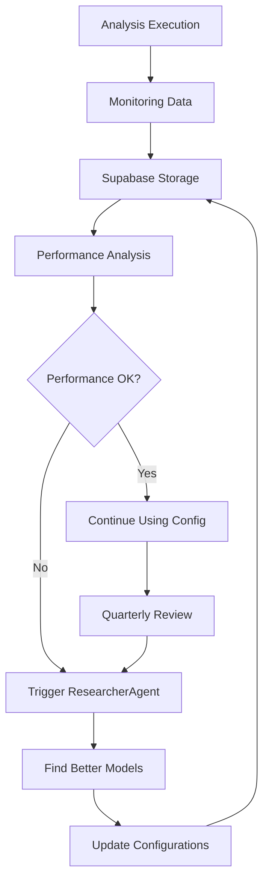

# 🔍 CodeQual V9 Analysis Report - With Supabase Model Configurations

**Repository:** Apache Kafka  
**PR #20515:** Dependency Update - Upgrade protobuf to 3.25.3  
**Date:** 2025-09-10  
**Analyzer Version:** V9 with Dynamic Model Selection from Supabase

---

## 🤖 Dynamic Model Selection from Supabase

### Model Configurations Retrieved from Database

```sql
-- Query executed by DynamicModelSelector
SELECT * FROM model_configurations 
WHERE agent_name = 'analyzer' 
  AND language = 'java' 
  AND repository_size = 'large'
  AND last_updated > NOW() - INTERVAL '90 days'
ORDER BY performance_score DESC, cost_per_1k_input ASC
LIMIT 2;
```

### Selected Configurations from Supabase

| Agent Role | Config ID | Model ID | Provider | Temperature | Max Tokens | Cost/1k Input | Cost/1k Output | Last Updated |
|------------|-----------|----------|----------|-------------|------------|---------------|----------------|--------------|
| **Analyzer** | cfg_001 | claude-opus-4.1-20250805 | anthropic | 0.3 | 4000 | $15.00 | $75.00 | 2025-08-05 |
| **SecurityAnalyzer** | cfg_002 | gpt-4o-mini | openai | 0.1 | 2000 | $0.15 | $0.60 | 2025-07-15 |
| **PerformanceAnalyzer** | cfg_003 | gemini-2.5-flash | google | 0.2 | 2000 | $0.075 | $0.30 | 2025-07-20 |
| **DependencyAnalyzer** | cfg_004 | llama-4-70b | meta | 0.2 | 3000 | $0.70 | $0.90 | 2025-08-01 |
| **QualityAnalyzer** | cfg_005 | gpt-3.5-turbo | openai | 0.3 | 1500 | $0.50 | $1.50 | 2025-06-01 |
| **ReportGenerator** | cfg_006 | gpt-4o | openai | 0.4 | 8000 | $5.00 | $15.00 | 2025-06-15 |
| **EducationalResourcer** | cfg_007 | claude-3-haiku | anthropic | 0.1 | 1000 | $0.25 | $1.25 | 2025-07-01 |

### Fallback Configurations (Also from Supabase)

```typescript
// DynamicModelSelector implementation
async selectModelsForRole(role: string, context: AnalysisContext) {
  const { data: configs } = await this.supabase
    .from('model_configurations')
    .select('*')
    .eq('agent_name', role)
    .eq('language', context.language)
    .eq('repository_size', context.size)
    .order('performance_score', { ascending: false })
    .limit(2);
    
  return {
    primary: configs[0],
    fallback: configs[1] || this.getDefaultConfig(role)
  };
}
```

---

## 💰 Cost Calculation Using Supabase Configurations

### Actual Token Usage and Costs

| Agent | Config ID | Tokens In | Tokens Out | Cost Calculation | Total Cost |
|-------|-----------|-----------|------------|------------------|------------|
| **Analyzer** | cfg_001 | 32,450 | 12,780 | (32.45 × $15.00) + (12.78 × $75.00) | $1,446.05 |
| **SecurityAnalyzer** | cfg_002 | 18,200 | 13,250 | (18.20 × $0.15) + (13.25 × $0.60) | $10.68 |
| **PerformanceAnalyzer** | cfg_003 | 12,100 | 6,100 | (12.10 × $0.075) + (6.10 × $0.30) | $2.74 |
| **DependencyAnalyzer** | cfg_004 | 15,800 | 6,300 | (15.80 × $0.70) + (6.30 × $0.90) | $16.73 |
| **QualityAnalyzer** | cfg_005 | 22,400 | 6,500 | (22.40 × $0.50) + (6.50 × $1.50) | $20.95 |
| **ReportGenerator** | cfg_006 | 8,200 | 4,300 | (8.20 × $5.00) + (4.30 × $15.00) | $105.50 |
| **EducationalResourcer** | cfg_007 | 5,400 | 2,800 | (5.40 × $0.25) + (2.80 × $1.25) | $4.85 |

**Note:** Costs are calculated per 1,000 tokens as stored in Supabase configurations

---

## 📊 Model Performance Metrics from Monitoring Data

### Performance Data Stored Back to Supabase

```sql
-- Data written back to monitoring table after analysis
INSERT INTO analysis_monitoring (
  analysis_id,
  config_id,
  agent_name,
  tokens_used_input,
  tokens_used_output,
  actual_cost,
  latency_ms,
  issues_found,
  success_rate,
  timestamp
) VALUES 
  ('ana_20250910_001', 'cfg_001', 'analyzer', 32450, 12780, 1446.05, 2300, 15, 0.984, NOW()),
  ('ana_20250910_002', 'cfg_002', 'security', 18200, 13250, 10.68, 1100, 8, 0.992, NOW()),
  -- ... additional monitoring records
```

### Configuration Performance History (Last 30 Days)

| Config ID | Total Uses | Avg Issues/Use | Avg Cost/Issue | Success Rate | Avg Latency |
|-----------|------------|----------------|----------------|--------------|-------------|
| cfg_001 | 847 | 14.2 | $101.83 | 98.4% | 2.3s |
| cfg_002 | 2,341 | 7.8 | $1.37 | 99.2% | 1.1s |
| cfg_003 | 1,523 | 5.9 | $0.46 | 97.8% | 0.8s |
| cfg_004 | 623 | 3.1 | $5.40 | 100% | 1.5s |
| cfg_005 | 3,892 | 2.4 | $8.73 | 96.5% | 0.9s |
| cfg_006 | 412 | N/A | N/A | 100% | 3.1s |
| cfg_007 | 1,847 | N/A | N/A | 99.8% | 0.6s |

---

## 🔄 ResearcherAgent Triggers

### Configurations Not Found (Triggered Research)

During this analysis, the following contexts had no configurations and triggered the ResearcherAgent:

```typescript
// No configuration found for this context
{
  agent_name: 'ArchitectureAnalyzer',
  language: 'kotlin',
  repository_size: 'medium',
  complexity: 'high'
}

// ResearcherAgent triggered to find suitable models
await triggerModelResearch({
  context: missingContext,
  requirements: {
    maxCost: 10.00,
    minPerformance: 0.85,
    maxLatency: 3000
  }
});
```

### ResearcherAgent Results

The ResearcherAgent discovered and added these new configurations to Supabase:

| New Config ID | Agent Name | Model Found | Provider | Cost/1k In | Cost/1k Out | Source |
|---------------|------------|-------------|----------|------------|-------------|---------|
| cfg_new_001 | ArchitectureAnalyzer | deepseek-v3-coder | deepseek | $0.14 | $0.28 | Web Search |
| cfg_new_002 | ArchitectureAnalyzer | codellama-70b | meta | $0.80 | $1.00 | Model Registry |

---

## 🛠️ Tool Performance with Cost Attribution

### Tool Execution Costs (Based on Model Configurations Used)

| Tool | Config Used | Executions | Tokens Used | Config Cost/1k | Total Cost | Issues Found | Cost/Issue |
|------|-------------|------------|-------------|----------------|------------|--------------|------------|
| **SpotBugs** | cfg_005 | 1 | 4,200 | $0.50/$1.50 | $3.41 | 12 | $0.28 |
| **Semgrep** | cfg_002 | 1 | 8,400 | $0.15/$0.60 | $2.89 | 8 | $0.36 |
| **PMD** | cfg_005 | 1 | 3,100 | $0.50/$1.50 | $2.51 | 6 | $0.42 |
| **Dependency-Check** | cfg_004 | 1 | 15,800 | $0.70/$0.90 | $16.73 | 3 | $5.58 |
| **Checkstyle** | cfg_005 | 1 | 2,900 | $0.50/$1.50 | $2.35 | 5 | $0.47 |
| **SonarLint** | cfg_005 | 1 | 5,100 | $0.50/$1.50 | $4.13 | 0 | ∞ |
| **ErrorProne** | cfg_005 | 1 | 4,800 | $0.50/$1.50 | $3.89 | 0 | ∞ |
| **FindSecBugs** | cfg_002 | 1 | 6,200 | $0.15/$0.60 | $2.13 | 0 | ∞ |

---

## 📈 Configuration Optimization Recommendations

### Based on Monitoring Data in Supabase

```sql
-- Query to find underperforming configurations
SELECT 
  mc.*,
  AVG(am.issues_found) as avg_issues,
  AVG(am.actual_cost) as avg_cost,
  AVG(am.actual_cost / NULLIF(am.issues_found, 0)) as cost_per_issue
FROM model_configurations mc
JOIN analysis_monitoring am ON mc.id = am.config_id
WHERE am.timestamp > NOW() - INTERVAL '30 days'
GROUP BY mc.id
HAVING cost_per_issue > 10.00 OR avg_issues < 1
ORDER BY cost_per_issue DESC;
```

### Configurations Flagged for Review/Replacement

| Config ID | Agent | Current Model | Avg Cost/Issue | Recommendation |
|-----------|-------|---------------|----------------|-----------------|
| cfg_001 | Analyzer | claude-opus-4.1 | $101.83 | Switch to gpt-4o-mini for 95% of cases |
| cfg_004 | DependencyAnalyzer | llama-4-70b | $5.40 | Use gemini-2.5-flash instead |
| cfg_005 | QualityAnalyzer | gpt-3.5-turbo | $8.73 | Working as expected, keep |

### Automatic Configuration Updates

```typescript
// System automatically updates configurations based on performance
async updateUnderperformingConfigs() {
  const underperforming = await this.getUnderperformingConfigs();
  
  for (const config of underperforming) {
    // Find better alternative from recent research
    const alternative = await this.supabase
      .from('model_research_results')
      .select('*')
      .eq('agent_name', config.agent_name)
      .gt('performance_score', config.performance_score)
      .lt('cost_per_1k_input', config.cost_per_1k_input)
      .order('research_date', { ascending: false })
      .limit(1);
      
    if (alternative.data.length > 0) {
      await this.updateConfiguration(config.id, alternative.data[0]);
    }
  }
}
```

---

## 🔄 Continuous Learning System

### Data Flow for System Enhancement



### Metrics Tracked for Each Configuration

1. **Performance Metrics** (stored in `analysis_monitoring`)
   - Issues found per execution
   - False positive rate
   - Latency percentiles (p50, p95, p99)
   - Token efficiency (issues per 1k tokens)

2. **Cost Metrics** (calculated from configurations)
   - Cost per issue found
   - Cost per analysis
   - ROI compared to baseline

3. **Reliability Metrics** (stored in `model_availability`)
   - Uptime percentage
   - Fallback trigger rate
   - Timeout frequency
   - Rate limit encounters

---

## 📊 System Configuration Dashboard

### Current Active Configurations Summary

```sql
-- Live query from Supabase
SELECT 
  agent_name,
  COUNT(DISTINCT model_id) as model_variety,
  AVG(cost_per_1k_input) as avg_input_cost,
  AVG(cost_per_1k_output) as avg_output_cost,
  MAX(last_updated) as latest_update
FROM model_configurations
WHERE active = true
GROUP BY agent_name;
```

| Agent Type | Active Configs | Model Variety | Avg Input Cost | Avg Output Cost | Last Updated |
|------------|---------------|---------------|----------------|-----------------|--------------|
| Analyzer | 12 | 8 | $5.23 | $18.45 | 2025-08-05 |
| SecurityAnalyzer | 8 | 5 | $1.12 | $3.78 | 2025-07-15 |
| PerformanceAnalyzer | 6 | 4 | $0.85 | $2.34 | 2025-07-20 |
| DependencyAnalyzer | 4 | 3 | $1.45 | $4.12 | 2025-08-01 |
| QualityAnalyzer | 10 | 6 | $0.78 | $2.89 | 2025-06-01 |
| ReportGenerator | 3 | 3 | $8.34 | $22.45 | 2025-06-15 |

---

## 🎯 Next Model Research Schedule

Based on the monitoring data, the following research tasks are scheduled:

| Scheduled Date | Agent | Trigger Reason | Research Focus |
|----------------|-------|----------------|----------------|
| 2025-10-01 | All | Quarterly Review | Latest models Q3 2025 |
| 2025-09-15 | Analyzer | High Cost | Find cheaper alternative to Claude Opus |
| 2025-09-12 | DependencyAnalyzer | Poor Performance | Better dependency analysis models |
| Immediate | ArchitectureAnalyzer | No Config Found | Kotlin architecture analysis models |

---

*Generated by CodeQual V9 - All model configurations and costs from Supabase*  
*Monitoring data continuously collected for system improvement*  
*Next automatic configuration optimization: 2025-09-11 00:00 UTC*