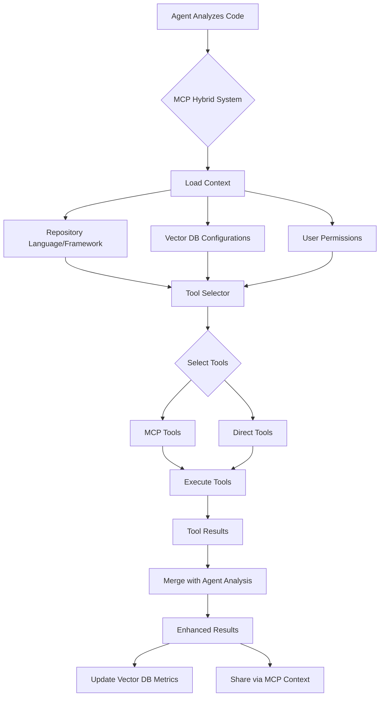

# MCP Hybrid Technical Design

## Addressing Key Challenges

### 1. Dynamic Model Independence

The MCP Hybrid system is designed to be completely independent of specific AI models. Here's how:

#### Role-Based Architecture

```typescript
// Tools are NEVER tied to specific models
// Instead, they're tied to agent roles and capabilities

interface AgentToolBinding {
  agentRole: AgentRole;  // 'security' | 'codeQuality' | 'performance' | etc.
  requiredCapabilities: string[];  // What the agent needs
  availableTools: {
    mcp: MCPTool[];
    direct: DirectTool[];
  };
}

// When RESEARCHER updates models, this mapping remains unchanged
// Example: Security agent can change from Claude to GPT-5 to DeepSeek
// The security tools (Semgrep, SonarQube) remain the same
```

#### Model-Agnostic Tool Interface

```typescript
class MCPHybridSystem {
  // Notice: No model information required
  async analyzeWithTools(
    agentRole: AgentRole,
    analysisContext: AnalysisContext,
    agentResults: any  // Results from ANY model
  ): Promise<EnhancedResults> {
    const tools = await this.selectToolsForRole(agentRole, analysisContext);
    const toolResults = await this.executeTools(tools, analysisContext);
    return this.mergeResults(agentResults, toolResults);
  }
}
```

### 2. Language and Context-Specific Tool Selection

#### Multi-Dimensional Matching System

```typescript
interface ToolSelectionCriteria {
  // Repository characteristics
  languages: string[];
  frameworks: string[];
  fileTypes: string[];
  repositorySize: 'small' | 'medium' | 'large';
  
  // Agent requirements
  agentRole: AgentRole;
  analysisDepth: 'quick' | 'standard' | 'deep';
  
  // User/Org constraints  
  userPermissions: string[];
  organizationTools: string[];
  complianceLevel: string;
}

class SmartToolSelector {
  private toolCapabilities = new Map<string, ToolCapability>();
  
  async selectTools(criteria: ToolSelectionCriteria): Promise<SelectedTools> {
    // Step 1: Get all tools for the agent role
    let candidateTools = this.getToolsForRole(criteria.agentRole);
    
    // Step 2: Filter by language compatibility
    candidateTools = candidateTools.filter(tool => {
      const toolLangs = this.toolCapabilities.get(tool.id)?.languages || [];
      return criteria.languages.some(lang => 
        toolLangs.includes(lang) || toolLangs.includes('*')
      );
    });
    
    // Step 3: Filter by framework compatibility
    candidateTools = candidateTools.filter(tool => {
      const toolFrameworks = this.toolCapabilities.get(tool.id)?.frameworks || [];
      return criteria.frameworks.length === 0 || 
        criteria.frameworks.some(fw => toolFrameworks.includes(fw));
    });
    
    // Step 4: Apply organization constraints
    candidateTools = candidateTools.filter(tool =>
      criteria.organizationTools.includes(tool.id)
    );
    
    // Step 5: Check availability and performance
    const availableTools = await this.checkAvailability(candidateTools);
    
    // Step 6: Rank by performance and relevance
    return this.rankTools(availableTools, criteria);
  }
}
```

#### Language-Specific Tool Examples

```typescript
const TOOL_LANGUAGE_MATRIX = {
  'eslint-mcp': {
    languages: ['javascript', 'typescript'],
    frameworks: ['react', 'vue', 'angular', 'express', 'nest'],
    fileExtensions: ['.js', '.jsx', '.ts', '.tsx', '.mjs']
  },
  'semgrep-mcp': {
    languages: ['*'], // Supports 20+ languages
    frameworks: ['*'], // Framework agnostic
    fileExtensions: ['*']
  },
  'sonarqube-mcp': {
    languages: ['*'], // Supports 30+ languages
    frameworks: ['*'],
    fileExtensions: ['*']
  },
  'jest-direct': {
    languages: ['javascript', 'typescript'],
    frameworks: ['*'],
    fileExtensions: ['.test.js', '.test.ts', '.spec.js', '.spec.ts']
  },
  'pytest-direct': {
    languages: ['python'],
    frameworks: ['django', 'flask', 'fastapi'],
    fileExtensions: ['.py', 'test_*.py', '*_test.py']
  }
};
```

### 3. Vector DB Integration for Configuration

#### Tool Configuration Storage

```typescript
// Store in special tool configuration repository
const TOOL_CONFIG_SCHEMA = {
  repository_id: '00000000-0000-0000-0000-000000000004',
  chunks: [
    {
      // Global tool registry
      type: 'tool_registry',
      content: {
        tools: [
          {
            id: 'eslint-mcp',
            type: 'mcp',
            server: '@eslint/mcp',
            capabilities: ['linting', 'auto-fix', 'style-check'],
            languages: ['javascript', 'typescript'],
            performance: {
              avg_execution_ms: 1200,
              success_rate: 0.98
            }
          }
        ]
      }
    },
    {
      // Repository-specific preferences
      type: 'repository_tool_config',
      repository_id: 'actual-repo-id',
      content: {
        enabled_tools: ['eslint-mcp', 'semgrep-mcp'],
        disabled_tools: ['sonarqube-mcp'], // Maybe too slow for this repo
        custom_configs: {
          'eslint-mcp': {
            rules: { 'no-console': 'error' }
          }
        }
      }
    }
  ]
};
```

#### Dynamic Configuration Loading

```typescript
class VectorDBToolConfigLoader {
  async loadToolConfigurations(
    repositoryId: string,
    agentRole: AgentRole
  ): Promise<ToolConfiguration> {
    // 1. Load global tool registry
    const globalTools = await this.vectorService.search(
      TOOL_CONFIG_REPOSITORY_ID,
      'tool_registry'
    );
    
    // 2. Load repository-specific preferences
    const repoPrefs = await this.vectorService.search(
      repositoryId,
      'tool_preferences'
    );
    
    // 3. Load organization policies
    const orgPolicies = await this.vectorService.search(
      this.user.organizationId,
      'tool_policies'
    );
    
    // 4. Merge configurations with proper precedence
    return this.mergeConfigurations(
      globalTools,
      repoPrefs,
      orgPolicies
    );
  }
}
```

### 4. Integration with MCP Context Manager

#### Enhanced MCP Context with Tool Awareness

```typescript
interface EnhancedMCPContext extends MCPContext {
  tool_context: {
    available_tools: Map<string, ToolStatus>;
    active_tools: string[];
    tool_results: Map<string, ToolResult>;
    tool_insights: CrossToolInsight[];
  };
}

class ToolAwareMCPManager extends MCPContextManager {
  async notifyToolDiscovery(
    agentRole: AgentRole,
    tool: string,
    discovery: any
  ): Promise<void> {
    // Share tool discoveries across agents
    this.addCrossAgentInsight(
      `${agentRole}-tool-${tool}`,
      'all',
      {
        type: 'tool_discovery',
        tool,
        discovery,
        suggestedActions: this.generateSuggestedActions(discovery)
      }
    );
  }
}
```

### 5. Handling Edge Cases

#### Graceful Degradation Chain

```typescript
class ResilientToolExecutor {
  async executeWithFallback(
    tools: Tool[],
    context: AnalysisContext
  ): Promise<ToolResult> {
    const results: ToolResult[] = [];
    
    for (const tool of tools) {
      try {
        // Try MCP tool first
        if (tool.type === 'mcp') {
          const result = await this.executeMCPTool(tool, context);
          if (result.success) {
            results.push(result);
            continue;
          }
        }
        
        // Fallback to direct tool
        const directEquivalent = this.findDirectEquivalent(tool);
        if (directEquivalent) {
          const result = await this.executeDirectTool(
            directEquivalent,
            context
          );
          if (result.success) {
            results.push(result);
            continue;
          }
        }
        
        // Final fallback: LLM-only analysis
        this.logger.warn(`All tools failed for ${tool.id}, using LLM only`);
        
      } catch (error) {
        this.logger.error(`Tool execution error: ${error.message}`);
        // Continue with next tool
      }
    }
    
    return this.combineResults(results);
  }
}
```

## Complete Integration Flow



## Configuration Examples

### Example 1: TypeScript Security Analysis

```typescript
// Input context
const context = {
  agentRole: 'security',
  repository: {
    languages: ['typescript', 'javascript'],
    frameworks: ['express', 'react'],
    size: 'medium'
  },
  files: ['src/auth/jwt.ts', 'src/api/user.controller.ts']
};

// Tool selection result
const selectedTools = {
  mcp: [
    'semgrep-mcp',    // Security scanning for TS/JS
    'sonarqube-mcp'   // Additional security rules
  ],
  direct: [
    'npm-audit'       // Dependency vulnerabilities
  ],
  excluded: {
    'eslint-mcp': 'Not needed for security analysis'
  }
};
```

### Example 2: Python Performance Analysis

```typescript
// Input context
const context = {
  agentRole: 'performance',
  repository: {
    languages: ['python'],
    frameworks: ['django'],
    size: 'large'
  },
  files: ['api/views.py', 'services/data_processor.py']
};

// Tool selection result
const selectedTools = {
  mcp: [
    'sonarqube-mcp'   // Has Python performance rules
  ],
  direct: [
    'cprofile',       // Python profiling
    'memory-profiler' // Memory usage analysis
  ],
  excluded: {
    'eslint-mcp': 'Language not supported',
    'jest-direct': 'Language not supported'
  }
};
```

## Benefits of This Architecture

1. **Model Independence**: Tools work with any AI model the RESEARCHER selects
2. **Language Awareness**: Appropriate tools for each language/framework
3. **Configuration Flexibility**: Vector DB stores preferences and overrides
4. **Graceful Degradation**: Multiple fallback options ensure analysis continues
5. **Performance Optimization**: Only run relevant tools for the context
6. **Easy Extension**: Add new MCP servers or direct tools without changing core logic
7. **Cross-Agent Insights**: Tools can share discoveries via MCP Context Manager

## Implementation Priority

1. **Core Framework** (Week 1)
   - Base interfaces and registry
   - Context matching system
   - Vector DB integration

2. **First Tools** (Week 2)
   - ESLint MCP (JavaScript/TypeScript)
   - Semgrep MCP (Multi-language security)
   - Jest Direct (Test coverage)

3. **Integration** (Week 3)
   - Multi-agent executor enhancement
   - MCP Context Manager integration
   - Performance monitoring

4. **Advanced Features** (Post-MVP)
   - Tool recommendation engine
   - Custom tool development
   - Advanced caching strategies
