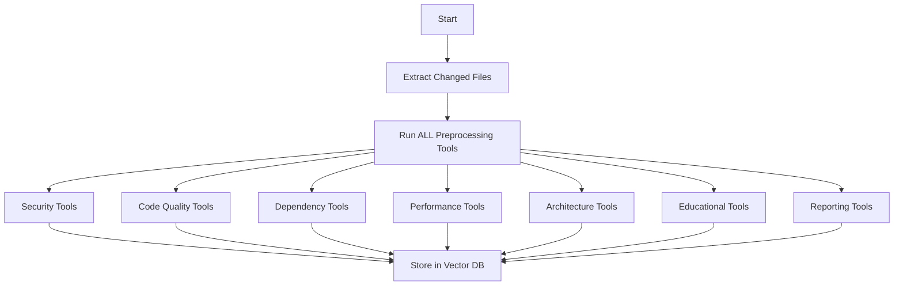
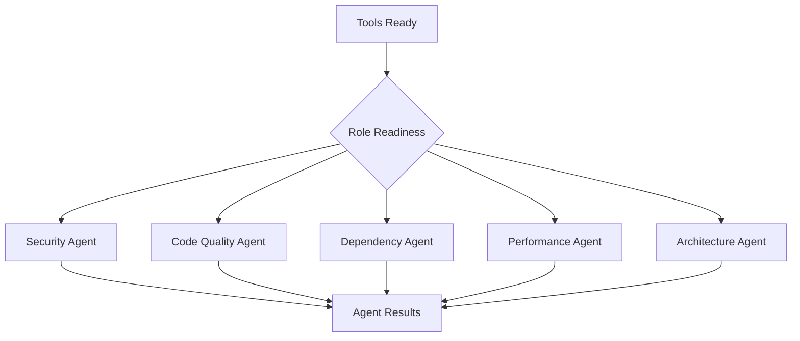
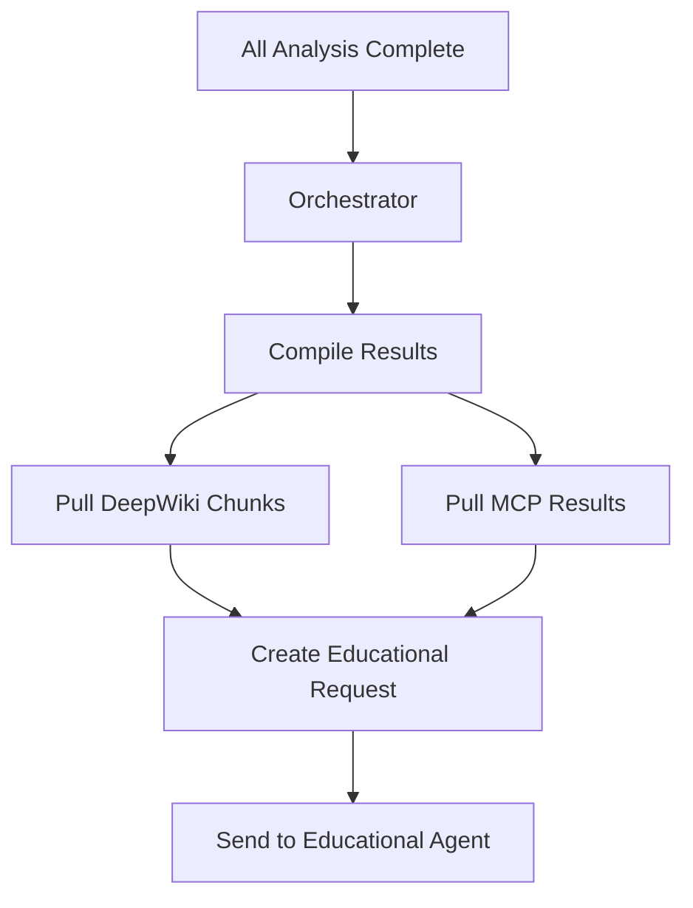
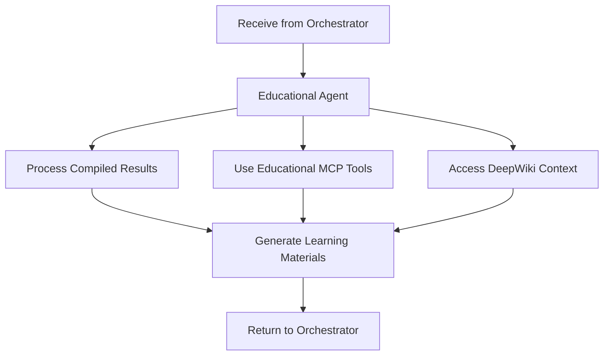
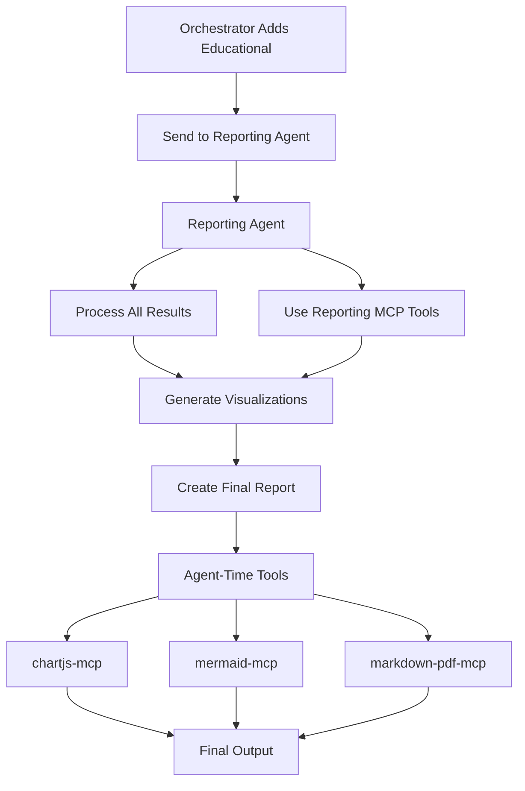

# Correct Agent Execution Flow

*Updated: January 28, 2025*

## Overview

This document clarifies the CORRECT execution flow for all agents. Educational and Reporting agents are NOT parallel with analysis agents - they run sequentially AFTER orchestration.

## 1. Phase 1: Preprocessing (Parallel)

All preprocessing tools run in parallel for ALL roles (including Educational and Reporting):



## 2. Phase 2: Analysis Agents (Parallel)

Analysis agents run in PARALLEL as soon as their tools are ready:



Each analysis agent receives:
- Changed files from PR
- DeepWiki repository chunk
- Pre-computed MCP tool results (from Vector DB)

## 3. Phase 3: Orchestrator Compilation

After ALL analysis agents complete:



Orchestrator creates request containing:
- Compiled results from all 5 analysis agents
- Relevant DeepWiki chunks
- Educational MCP tool results

## 4. Phase 4: Educational Agent (Sequential)

Educational agent runs AFTER orchestration:



Educational agent receives:
- Compiled analysis results (NOT raw tool outputs)
- DeepWiki educational chunks
- Pre-computed educational MCP results (Tavily tutorials, etc.)

## 5. Phase 5: Reporting Agent (Sequential)

Reporting agent runs LAST:



Reporting agent receives:
- Complete compiled results + educational output
- Pre-computed reporting MCP results
- Executes visualization tools at agent-time

## 6. Tool Execution Timeline

```
Time →
├─ Preprocessing (0-60s)
│  ├─ All tools run in parallel
│  └─ Results stored in Vector DB
│
├─ Analysis Agents (60-120s)
│  ├─ Security Agent starts at 60s
│  ├─ Code Quality starts at 65s
│  ├─ Dependency starts at 65s
│  ├─ Performance starts at 70s
│  └─ Architecture starts at 70s
│
├─ Orchestrator Compilation (120-130s)
│  └─ Waits for ALL analysis agents
│
├─ Educational Agent (130-150s)
│  └─ Processes compiled results
│
└─ Reporting Agent (150-180s)
   └─ Creates final report with visualizations
```

## 7. Key Differences from Incorrect Understanding

### INCORRECT ❌:
- Educational runs in parallel with analysis agents
- Educational reads raw MCP tool results
- Reporting depends on all other agents directly

### CORRECT ✅:
- Educational runs AFTER orchestrator compilation
- Educational receives compiled results + context
- Reporting runs LAST with all results + educational output

## 8. Preprocessing Tools by Role

Even though Educational and Reporting run sequentially, their tools still run during preprocessing:

### Educational Preprocessing Tools:
- `context-mcp` - Retrieves educational context
- `knowledge-graph-mcp` - Identifies learning concepts
- `tavily-mcp` - Searches for tutorials (role-specific queries)
- `mcp-memory` - Retrieves learning history

### Reporting Preprocessing Tools:
- `tavily-mcp` - Industry standards (role-specific queries)
- `git-mcp` - Repository statistics

### Reporting Agent-Time Tools:
- `chartjs-mcp` - Generate charts
- `mermaid-mcp` - Create diagrams
- `markdown-pdf-mcp` - Format report
- `grafana-direct` - Push to dashboard

## 9. Data Flow Summary

1. **Preprocessing**: ALL tools → Vector DB
2. **Analysis Agents**: Read from Vector DB → Analyze → Results
3. **Orchestrator**: Compile all results → Create educational request
4. **Educational**: Process compiled data → Generate learning materials
5. **Orchestrator**: Add educational output → Create reporting request
6. **Reporting**: Process everything → Generate visualizations → Final report

This sequential flow ensures that Educational and Reporting agents have access to the complete analysis context, not just raw tool outputs.