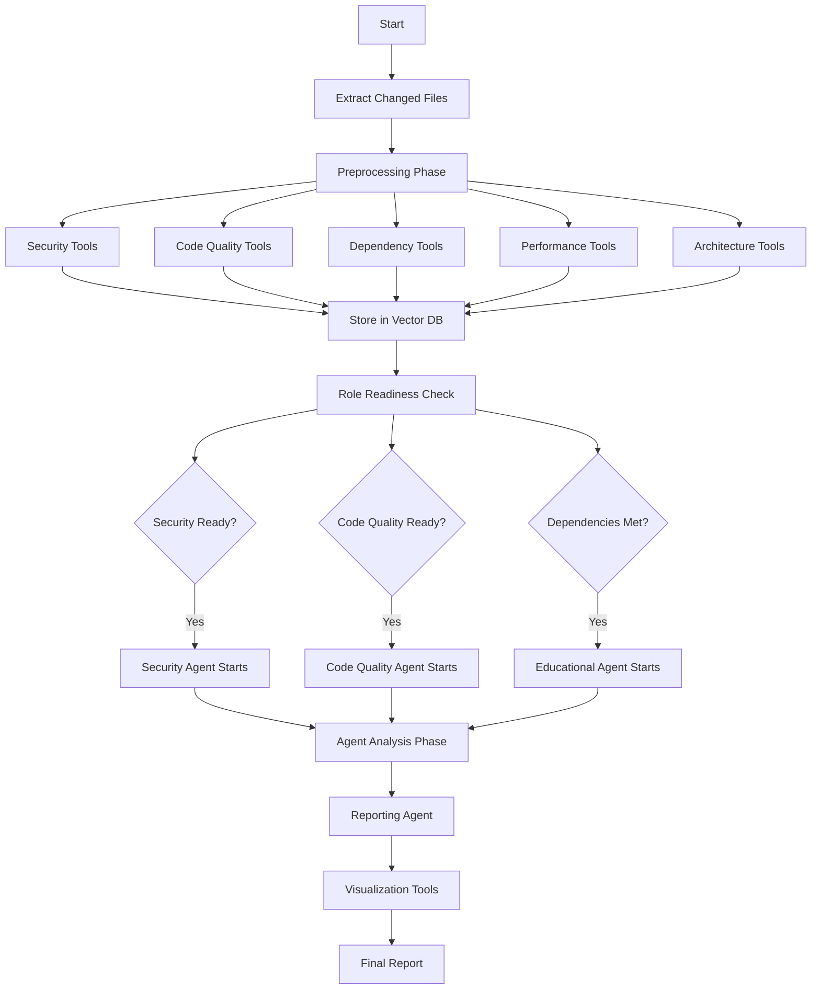

# Tool Categorization - Preprocessing vs Agent-Time Execution

*Updated: January 28, 2025*

## Overview

This document categorizes all tools based on when they should execute:
1. **Preprocessing Tools**: Run ONCE before agents start, results stored in Vector DB
2. **Agent-Time Tools**: Run DURING agent analysis (should be minimal)
3. **Duplicate/Unnecessary**: Tools that can be removed or consolidated

## 1. PREPROCESSING TOOLS (Run Once, Store Results)

### Security Role
- ✅ **semgrep-mcp** - Static code security analysis
- ✅ **mcp-scan** - Security verification 
- ✅ **npm-audit-direct** - Dependency vulnerabilities
- ✅ **sonarqube** - Comprehensive security/quality scan
- ✅ **tavily-mcp** - Web search for CVEs (role-specific queries)

### Code Quality Role  
- ✅ **eslint-direct** - JavaScript/TypeScript linting
- ✅ **sonarjs-direct** - Advanced quality rules
- ✅ **jscpd-direct** - Copy-paste detection
- ✅ **prettier-direct** - Formatting validation
- ✅ **serena-mcp** - Semantic code understanding
- ✅ **sonarqube** - Quality metrics

### Dependency Role
- ✅ **npm-audit-direct** - Security vulnerabilities
- ✅ **license-checker-direct** - License compliance
- ✅ **npm-outdated-direct** - Version currency
- ✅ **dependency-cruiser-direct** - Dependency rules
- ✅ **tavily-mcp** - Package research (role-specific)

### Performance Role
- ✅ **lighthouse-direct** - Web performance metrics
- ✅ **bundlephobia-direct** - Bundle size analysis
- ✅ **sonarqube** - Complexity metrics
- ✅ **sonarjs-direct** - Performance patterns

### Architecture Role
- ✅ **madge-direct** - Circular dependencies
- ✅ **dependency-cruiser-direct** - Architecture rules
- ✅ **git-mcp** - Repository structure analysis
- ✅ **serena-mcp** - Code structure insights

### Educational Role
- ✅ **context-mcp** - Vector DB context retrieval
- ✅ **knowledge-graph-mcp** - Learning paths
- ✅ **tavily-mcp** - Tutorial search (role-specific)
- ✅ **mcp-memory** - Previous learning history

### Reporting Role
- ✅ **tavily-mcp** - Industry standards (role-specific)
- ✅ **git-mcp** - Repository statistics

## 2. AGENT-TIME TOOLS (Run During Analysis)

These tools should run DURING agent analysis, not preprocessing:

### Reporting Role (Visualization)
- ⏱️ **chartjs-mcp** - Generate charts from analyzed data
- ⏱️ **mermaid-mcp** - Create diagrams from architecture
- ⏱️ **markdown-pdf-mcp** - Format final report
- ⏱️ **grafana-direct** - Push metrics to dashboard

### Educational Role (Interactive)
- ⏱️ **context7-mcp** - Real-time documentation lookup (if needed)
- ⏱️ **working-examples-mcp** - Find examples based on findings
- ⏱️ **mcp-docs-service** - Documentation generation

## 3. DUPLICATE/REDUNDANT TOOLS

### Remove/Consolidate:
- ❌ **web-search-mcp** - Duplicate of Tavily (remove)
- ❌ **ref-mcp** - Replaced by Tavily (remove)
- ⚠️ **sonarqube** - Used by multiple roles (keep but deduplicate execution)

## 4. TOOL EXECUTION FLOW

## 5. SERENA MCP VISIBILITY

**Serena MCP** appears in:
- Code Quality role (primary)
- Architecture role (secondary)

It provides:
- Semantic code understanding
- Refactoring suggestions
- Architecture insights
- Code pattern detection

## 6. IMPLEMENTATION RECOMMENDATIONS

### Immediate Actions:
1. **Remove duplicates**: web-search-mcp, ref-mcp
2. **Implement per-role readiness**: Allow agents to start as tools complete
3. **Move visualization tools**: Keep chartjs, mermaid, markdown-pdf for agent-time
4. **Deduplicate shared tools**: Run sonarqube once, share results

### Preprocessing Tools Summary:
- **Total**: ~25 unique tools
- **Shared**: sonarqube, npm-audit, dependency-cruiser
- **Role-specific**: Most tools are role-specific

### Benefits:
- Agents start 50-100x faster (no tool execution)
- Security agent can start while others still preprocessing
- Consistent results across all agents
- Reduced API costs (single execution)

## 7. TAVILY OPTIMIZATION

Since Tavily is expensive, we generate role-specific queries:
- Security: 3-5 CVE/vulnerability searches
- Code Quality: 2-3 best practice searches
- Dependencies: 2-3 package/license searches
- Educational: 3-4 tutorial searches
- Reporting: 1-2 industry standard searches

Total: ~15-20 searches per PR (vs 100+ if each agent ran separately)