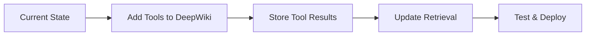

# Tool Integration Following DeepWiki Pattern

## Overview

Instead of creating an "enhanced" context, we follow the established pattern:
1. Tools run during DeepWiki analysis and store results directly in Vector DB
2. Orchestrator retrieves relevant tool results from Vector DB for each agent
3. Each agent receives only the tool results relevant to their role

## Architecture (Following Existing Pattern)

```
┌─────────────────────────────────────────────────────────────────────┐
│                            PR Analysis Flow                          │
└─────────────────────────────────────────────────────────────────────┘
                                    │
                                    ▼
                        ┌─────────────────────┐
                        │    Orchestrator     │
                        │  - Analyze PR       │
                        │  - Check Vector DB  │
                        └─────────────────────┘
                                    │
                    ┌───────────────┴───────────────┐
                    │                               │
                    ▼                               ▼
        ┌─────────────────────┐         ┌─────────────────────┐
        │  Vector DB Check    │   NO    │   DeepWiki Service  │
        │  - DeepWiki Report  ├────────►│  - Clone Repository │
        │  - Tool Results     │         │  - Run Analysis     │
        └─────────────────────┘         │  - Run Tools        │
                    │                   └───────────┬─────────┘
                YES │                               │
                    │                               ▼
                    │                   ┌─────────────────────┐
                    │                   │  Store in Vector DB │
                    │                   │  - DeepWiki Report  │
                    │                   │  - Tool Results     │
                    │                   └───────────┬─────────┘
                    │                               │
                    └───────────────┬───────────────┘
                                    │
                                    ▼
                        ┌─────────────────────┐
                        │ Orchestrator Retrieves│
                        │ Agent-Specific Data  │
                        └─────────────────────┘
                                    │
                ┌───────────────────┼───────────────────┐
                ▼                   ▼                   ▼
    ┌─────────────────┐ ┌─────────────────┐ ┌─────────────────┐
    │ Security Agent  │ │Code Quality Agent│ │Architecture Agent│
    │ Context:        │ │ Context:         │ │ Context:         │
    │ - Security      │ │ - Code Quality   │ │ - Architecture   │
    │   findings      │ │   findings       │ │   findings       │
    │ - NPM Audit     │ │ - ESLint results │ │ - Madge results  │
    │ - License Check │ │ - Prettier       │ │ - Dep Cruiser    │
    └─────────────────┘ └─────────────────┘ └─────────────────┘
```

## Implementation Following Existing Pattern

### 1. Extend DeepWiki to Run Tools

```python
# deepwiki/services/tool_runner.py

class ToolRunner:
    """Runs analysis tools on cloned repository"""
    
    def __init__(self, repo_path: str):
        self.repo_path = repo_path
        self.tools = {
            'npm-audit': self.run_npm_audit,
            'license-checker': self.run_license_checker,
            'madge': self.run_madge,
            'eslint': self.run_eslint,
            'npm-outdated': self.run_npm_outdated,
        }
    
    async def run_all_tools(self) -> Dict[str, Any]:
        """Run all applicable tools in parallel"""
        results = {}
        
        # Determine which tools to run based on repository
        applicable_tools = self.get_applicable_tools()
        
        # Run tools in parallel
        with ThreadPoolExecutor(max_workers=5) as executor:
            future_to_tool = {
                executor.submit(self.tools[tool]): tool 
                for tool in applicable_tools
            }
            
            for future in as_completed(future_to_tool):
                tool_name = future_to_tool[future]
                try:
                    results[tool_name] = future.result()
                except Exception as e:
                    results[tool_name] = {'error': str(e)}
        
        return results
    
    def get_applicable_tools(self) -> List[str]:
        """Determine which tools apply to this repository"""
        tools = []
        
        # Check for Node.js project
        if os.path.exists(os.path.join(self.repo_path, 'package.json')):
            tools.extend(['npm-audit', 'license-checker', 'npm-outdated'])
        
        # Check for JavaScript/TypeScript files
        if self.has_js_files():
            tools.extend(['eslint', 'madge'])
        
        return tools
```

### 2. Store Tool Results in Vector DB (Same Pattern)

```typescript
// packages/agents/src/multi-agent/tool-result-storage.ts

export class ToolResultStorage {
  constructor(private vectorDB: VectorStorageService) {}
  
  /**
   * Store tool results following the same pattern as DeepWiki reports
   */
  async storeToolResults(
    repositoryId: string,
    toolResults: Record<string, ToolResult>,
    userId: string
  ): Promise<void> {
    const chunks: AnalysisChunk[] = [];
    
    // Store each tool result as a separate chunk
    for (const [toolName, result] of Object.entries(toolResults)) {
      // Security tools
      if (['npm-audit', 'license-checker'].includes(toolName)) {
        chunks.push({
          repository_id: repositoryId,
          source_type: 'tool',
          content: JSON.stringify(result),
          metadata: {
            content_type: 'tool_result',
            tool_name: toolName,
            agent_role: 'security',
            severity: this.extractMaxSeverity(result),
            findings_count: result.findings?.length || 0,
            timestamp: new Date().toISOString()
          },
          storage_type: 'permanent'
        });
      }
      
      // Architecture tools
      if (['madge', 'dependency-cruiser'].includes(toolName)) {
        chunks.push({
          repository_id: repositoryId,
          source_type: 'tool',
          content: JSON.stringify(result),
          metadata: {
            content_type: 'tool_result',
            tool_name: toolName,
            agent_role: 'architecture',
            circular_deps: result.metrics?.circularDependencies || 0,
            timestamp: new Date().toISOString()
          },
          storage_type: 'permanent'
        });
      }
      
      // Code quality tools
      if (['eslint', 'prettier', 'sonarjs'].includes(toolName)) {
        chunks.push({
          repository_id: repositoryId,
          source_type: 'tool',
          content: JSON.stringify(result),
          metadata: {
            content_type: 'tool_result',
            tool_name: toolName,
            agent_role: 'codeQuality',
            issues_count: result.findings?.length || 0,
            fixable_count: result.metrics?.fixableIssues || 0,
            timestamp: new Date().toISOString()
          },
          storage_type: 'permanent'
        });
      }
      
      // Dependency tools
      if (['npm-outdated'].includes(toolName)) {
        chunks.push({
          repository_id: repositoryId,
          source_type: 'tool',
          content: JSON.stringify(result),
          metadata: {
            content_type: 'tool_result',
            tool_name: toolName,
            agent_role: 'dependency',
            outdated_count: result.metrics?.totalOutdated || 0,
            timestamp: new Date().toISOString()
          },
          storage_type: 'permanent'
        });
      }
    }
    
    // Store all chunks
    await this.vectorDB.storeChunks(chunks, userId);
  }
}
```

### 3. Orchestrator Retrieves Agent-Specific Tool Results

```typescript
// apps/api/src/services/orchestrator-tool-integration.ts

export class OrchestratorWithTools extends Orchestrator {
  /**
   * Retrieve context for each agent including relevant tool results
   */
  async prepareAgentContexts(
    repositoryId: string,
    prContext: PRContext
  ): Promise<AgentContextMap> {
    const contexts: AgentContextMap = {};
    
    // Security Agent Context
    contexts.security = await this.vectorDB.retrieveContext({
      repository_id: repositoryId,
      filters: [
        { metadata: { agent_role: 'security' } },
        { metadata: { tool_name: { $in: ['npm-audit', 'license-checker'] } } }
      ],
      includeTypes: ['deepwiki_section', 'tool_result']
    });
    
    // Architecture Agent Context
    contexts.architecture = await this.vectorDB.retrieveContext({
      repository_id: repositoryId,
      filters: [
        { metadata: { agent_role: 'architecture' } },
        { metadata: { tool_name: { $in: ['madge', 'dependency-cruiser'] } } }
      ],
      includeTypes: ['deepwiki_section', 'tool_result']
    });
    
    // Code Quality Agent Context
    contexts.codeQuality = await this.vectorDB.retrieveContext({
      repository_id: repositoryId,
      filters: [
        { metadata: { agent_role: 'codeQuality' } },
        { metadata: { tool_name: { $in: ['eslint', 'prettier', 'sonarjs'] } } }
      ],
      includeTypes: ['deepwiki_section', 'tool_result']
    });
    
    // Performance Agent Context
    contexts.performance = await this.vectorDB.retrieveContext({
      repository_id: repositoryId,
      filters: [
        { metadata: { agent_role: 'performance' } },
        { metadata: { tool_name: { $in: ['bundlephobia'] } } }
      ],
      includeTypes: ['deepwiki_section', 'tool_result']
    });
    
    // Dependency Agent Context
    contexts.dependency = await this.vectorDB.retrieveContext({
      repository_id: repositoryId,
      filters: [
        { metadata: { agent_role: 'dependency' } },
        { metadata: { tool_name: { $in: ['npm-outdated', 'license-checker'] } } }
      ],
      includeTypes: ['deepwiki_section', 'tool_result']
    });
    
    return contexts;
  }
}
```

### 4. Agents Receive Formatted Context (No Changes Needed)

```typescript
// The existing agent implementation already handles this pattern!
// Each agent receives context from Vector DB based on their role

export class SecurityAgent {
  async analyze(context: AgentContext): Promise<AgentResult> {
    // Context already includes:
    // - DeepWiki security findings
    // - NPM Audit results (if available)
    // - License Checker results (if available)
    
    const deepwikiFindings = context.deepwikiAnalysis.security;
    const npmAuditResults = context.toolResults?.['npm-audit'];
    const licenseResults = context.toolResults?.['license-checker'];
    
    // Agent analyzes using all available data
    return this.generateSecurityInsights({
      deepwikiFindings,
      npmAuditResults,
      licenseResults
    });
  }
}
```

## Key Benefits of Following the Existing Pattern

1. **Consistency**: Same flow as DeepWiki - analyze, store, retrieve
2. **Separation of Concerns**: Tools don't know about agents
3. **Scalability**: Easy to add new tools without changing agents
4. **Caching**: Tool results cached in Vector DB like DeepWiki results
5. **Flexibility**: Orchestrator decides what each agent needs

## Implementation Steps

### Phase 1: DeepWiki Enhancement (3-4 days)
1. Add tool execution to DeepWiki service
2. Install required tools in DeepWiki container
3. Implement parallel tool execution

### Phase 2: Vector DB Storage (2 days)
1. Extend storage schema for tool results
2. Implement tool result storage service
3. Add proper metadata for filtering

### Phase 3: Orchestrator Updates (2 days)
1. Update context retrieval to include tool results
2. Ensure proper filtering by agent role
3. Test with real repositories

### Phase 4: Testing & Optimization (3 days)
1. End-to-end testing with various repositories
2. Performance optimization
3. Error handling and recovery

## Migration Path



## Example: How It Works

1. **PR Submitted**: `github.com/user/repo/pull/123`

2. **DeepWiki Analysis**:
   ```python
   # In DeepWiki pod
   results = {
       'deepwiki': analyze_repository(repo_path),
       'tools': await run_all_tools(repo_path)
   }
   store_in_vector_db(results)
   ```

3. **Vector DB Storage**:
   ```
   ├── DeepWiki Report (existing)
   ├── NPM Audit Results (new)
   ├── License Checker Results (new)
   ├── Madge Results (new)
   └── ESLint Results (new)
   ```

4. **Orchestrator Retrieval**:
   ```typescript
   // For Security Agent
   const securityContext = {
     deepwiki: getChunks({agent_role: 'security'}),
     tools: getChunks({tool_name: ['npm-audit', 'license-checker']})
   };
   ```

5. **Agent Analysis**: Each agent receives only relevant data

This approach maintains the elegant architecture while adding powerful tool insights!
